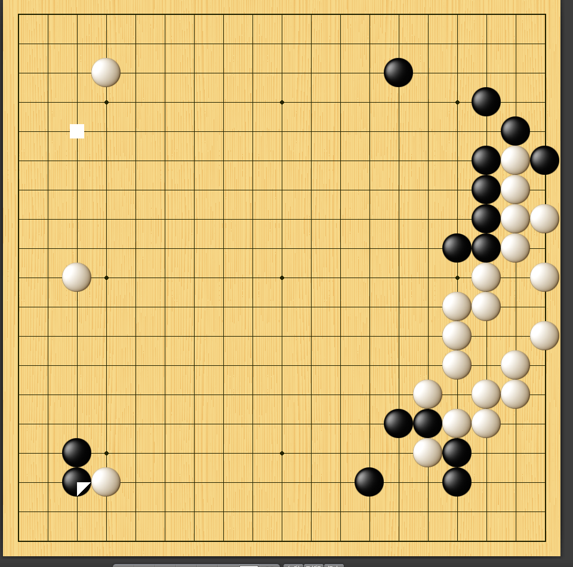
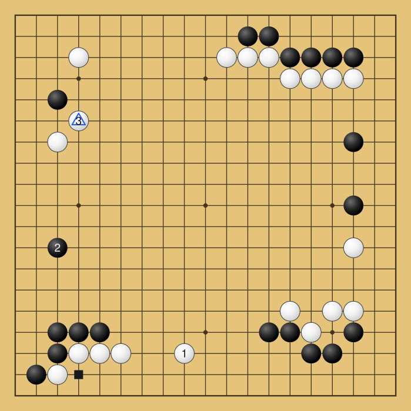
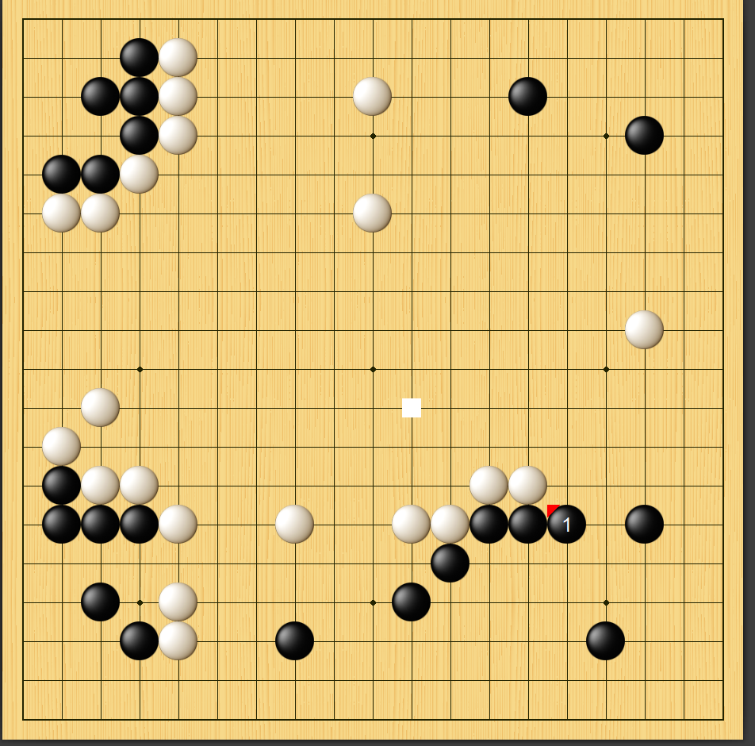
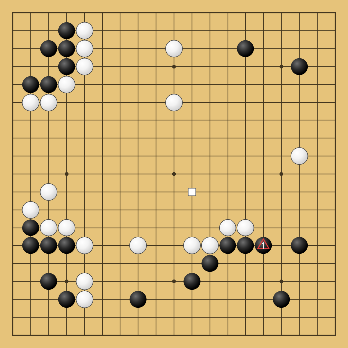
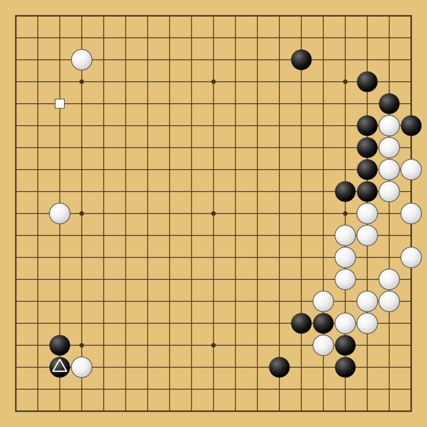
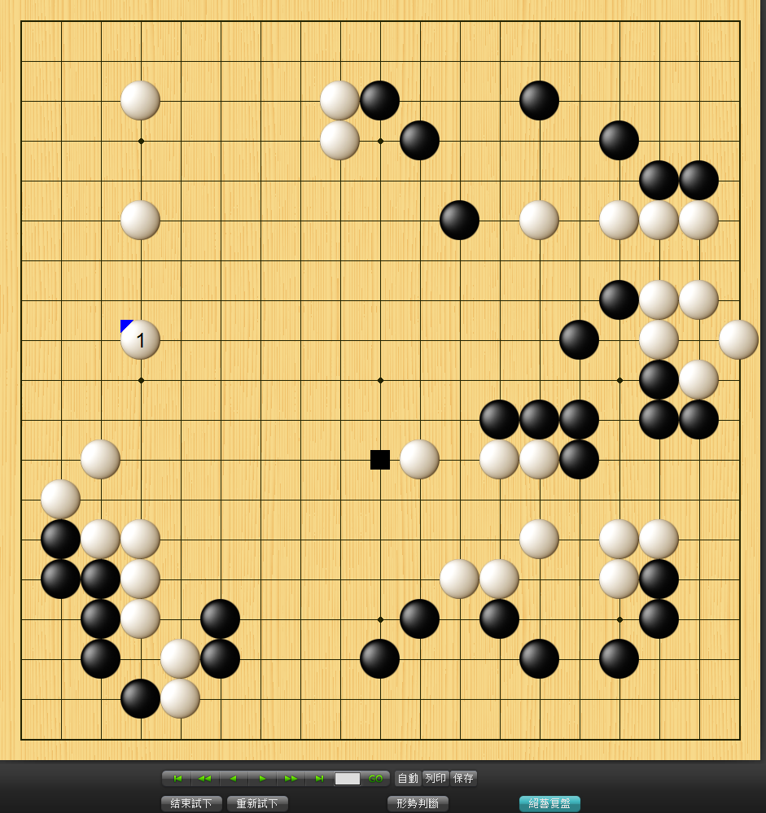
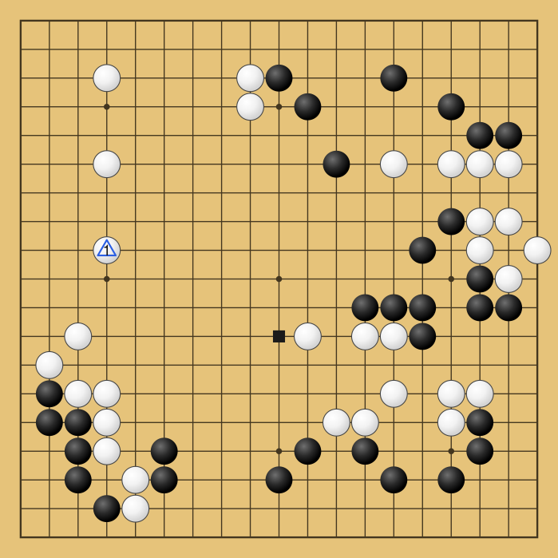

# goban-svg

Convert a screenshot of a Go (圍棋/baduk) board into a clean, scalable SVG diagram — grid,
stones, move-number labels, and the app's marker badges — with zero runtime dependencies
(pure Python ≥ 3.10 stdlib, including its own PNG codec).

```
screenshot ──extract──▶ Position (JSON, faithful) ──render──▶ SVG  (+ SGF export)
```

The JSON in the middle is the point: it's human-editable. If the extractor misreads
something, you fix one line of JSON and re-render — that's the designed correction loop.

## Install

```bash
uv tool install .            # from a checkout — installs the `goban-svg` command
uvx --from . goban-svg ...   # or run without installing
uv tool install '.[images]'  # optional: Pillow fallback for JPEG/WebP/interlaced-PNG input
```

## Usage

```bash
goban-svg convert board.png                  # → board.svg + board.json sidecar
goban-svg convert board.png --sgf board.sgf --ascii --preview preview.png
goban-svg extract board.png -o board.json    # screenshot → JSON only
goban-svg render  board.json -o board.svg    # JSON (or .sgf) → SVG; the correction loop
goban-svg render  board.json --coords --cell 40
goban-svg photo   photo.jpg --corners 132,88 940,95 910,760 155,742 --size 19
                  # EXPERIMENTAL: photos of physical boards — you mark the four corner
                  # intersections (TL TR BR BL, roughly is fine: they are auto-refined
                  # against the detected grid; --no-refine to trust them exactly);
                  # stones only; verify the result by hand
```

`convert` prints a one-line summary (`19×19, 20 black, 20 white, 2 marks, 3 labels → board.svg`)
and any extraction warnings on stderr — a warning names the exact point to check by hand.

Outputs overwrite silently (re-rendering is the point) with one guarded exception: `convert`
refuses to replace a JSON sidecar whose content differs from this run's extraction — that
difference is usually your hand corrections. Re-render those with `goban-svg render`, write
the sidecar elsewhere with `--json`, or override with `--force`.

## JSON schema (the interchange format)

```json
{
  "size": 19,
  "stones": {"black": ["C8", "..."], "white": ["D14", "..."]},
  "marks": [
    {"point": "D2",  "type": "square",   "color": "black"},
    {"point": "D14", "type": "triangle", "color": "#2b5fe3"}
  ],
  "labels": {"D14": "3"}
}
```

Columns skip `I` (Go convention): `A`–`T` on 19×19, up to `Z` on a 25-board; rows count
from the bottom. Mark types: `triangle` / `square` / `circle` / `cross`; `color` is
`"black"`, `"white"`, `"#rrggbb"`, or omitted (auto-contrast at render time). Board sizes
2–25 are supported; during *extraction*, anything other than 9/13/19 also gets a warning.

## SGF support + limits

`--sgf` exports and `render` reads static-position SGF (FF[4]: `AB/AW/AE`, `TR/SQ/CR/MA/LB`,
compressed point lists, full SimpleText escaping). Limits, by design: game records with
moves (`B[]`/`W[]`) are rejected ("static positions only" — playing out captures is out of
scope), variations are rejected, and **SGF cannot carry mark colors** (a white square and a
black square both become `SQ[]`) — which is exactly why JSON is the faithful intermediate
and SGF an export.

## Gallery

The four example boards, extracted from real screenshots of two different Go apps
(left: input screenshot, committed in `examples/`; right: the SVG this tool produced
from it):

| Input | Output |
|---|---|
|  |  |
|  |  |
|  |  |
|  |  |

Every feature the apps draw survives the trip: numbered move labels (①②③), the colored
corner "wedge" badges (recorded as triangle marks in the badge's color), and solid square
markers on empty points. `examples/*.json` are the verified extractions — boards 1–3
verified stone-by-stone by hand, board-4 via a class-ring overlay diff — and they double
as the extractor's regression fixtures (`tests/test_real_examples.py`).

## Development

```bash
uv sync --dev
uv run pytest            # 400+ tests, no external fixtures needed (see below)
uv run ruff check . && uv run ruff format --check .
```

The extractor is tested by round-trip against its own app-style raster painter
(`render_png`): paint a known `Position` → extract it → assert exact equality — plus
regression tests against the three real screenshots, which is what keeps the synthetic
loop honest. CI runs on Python 3.10 and 3.13.

Canonical docs: `docs/design.md` (the locked design), `docs/interfaces.md` (module
contracts), `docs/build-learnings.md` (what went wrong and why, worth reading first).

## Repository layout

| Path | Tracked | Purpose |
|------|---------|---------|
| `README.md` | tracked | This file — repo map + purpose |
| `CLAUDE.md` | tracked | Project working memory for AI sessions |
| `.gitignore` | tracked | Root-anchored ignore rules (Python/uv + transient outputs) |
| `pyproject.toml` | tracked | Package metadata (hatchling, src-layout), ruff + pytest config, uv dev deps |
| `uv.lock` | tracked | uv lockfile (dev tooling; the package itself has zero runtime deps) |
| `src/goban_svg/` | tracked | The package: board model, PNG codec, digit OCR, SGF, renderers, extractor, CLI |
| `tests/` | tracked | pytest suite — synthetic round-trips + real-screenshot regression tests |
| `docs/` | tracked | Canonical docs: `design.md` (locked design handoff), `interfaces.md` (module contract), `build-learnings.md` |
| `examples/` | tracked | The three source screenshots + verified `.json`/`.svg`/`.sgf` outputs (the gallery + regression fixtures) |
| `screenshots/` | **gitignored** | Raw input inbox for board screenshots (curated copies go to `examples/`) |
| `outputs/` | **gitignored** | Transient artifacts (previews, spike logs) |
| `web/` | tracked | The zh-TW web app (static; Pyodide runs the package in-browser) → goban-svg.pages.dev |
| `web/assets/` | tracked | Static images the app serves (corner-placement 正確／錯誤 guidance photos for photo mode) |
| `web/wheels/` | tracked | Immutable published-wheel archive: every wheel ever deployed, byte-for-byte, + `SHA256SUMS` (deploy refuses to replace published bytes; smoke re-verifies each URL) |
| `scripts/` | tracked | `deploy-web.sh` — deterministic build + stage + Cloudflare Pages deploy; `smoke-web.sh` — post-deploy assertions (headers, runtime, published-wheel hashes) |
| `web-dist/` | **gitignored** | Deploy staging built by `scripts/deploy-web.sh` (wheel + self-hosted Pyodide) |
| `session_logs/` | tracked | Per-session provenance logs + changelog archives (fleet doc lifecycle) |
| `session_handoff/` | tracked | Starter-prompt handoffs for the next session (fleet doc lifecycle) |
| `.github/workflows/` | tracked | CI: ruff check + format + pytest on Python 3.10/3.13 |

> Rule: any new top-level file or directory gets a row here **in the same commit** (fleet taxonomy standard).
